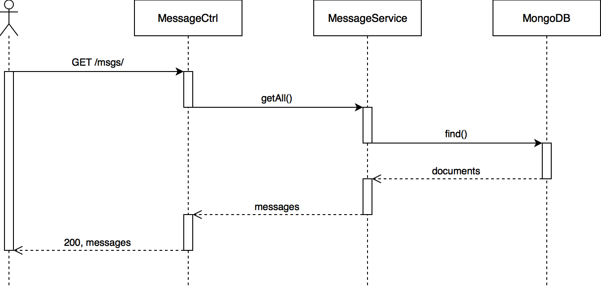
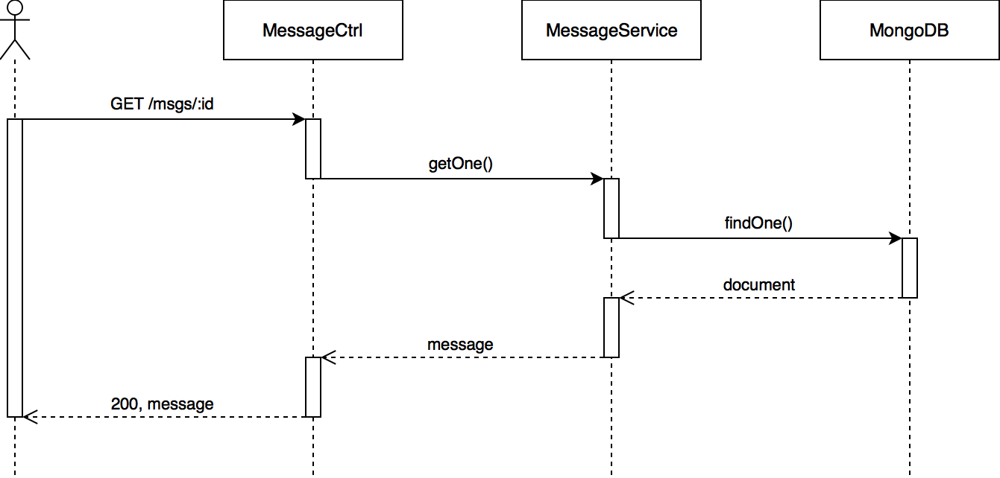
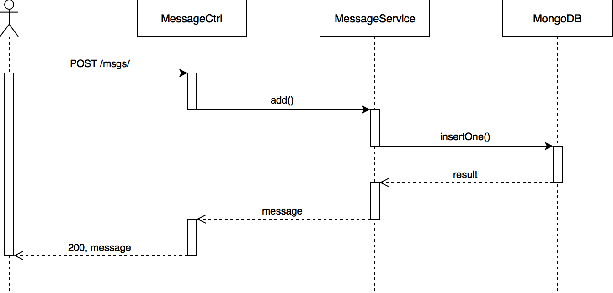
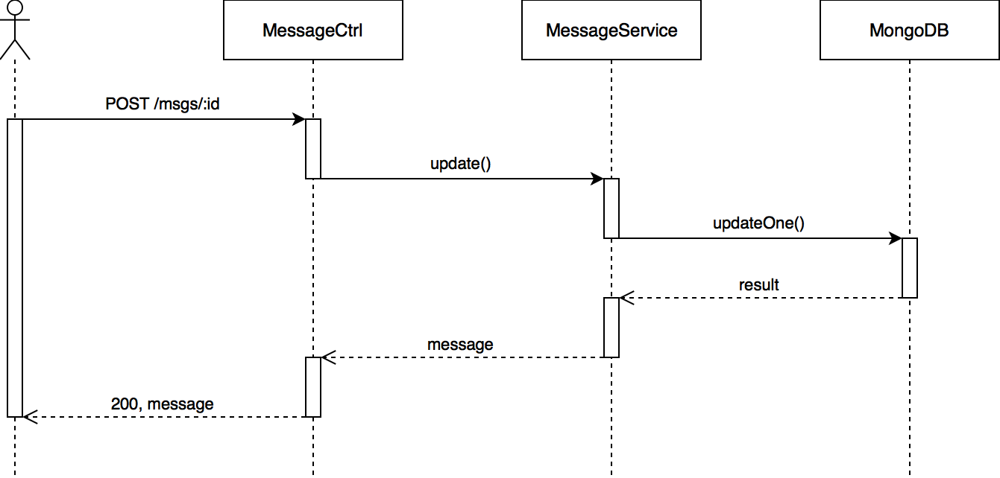
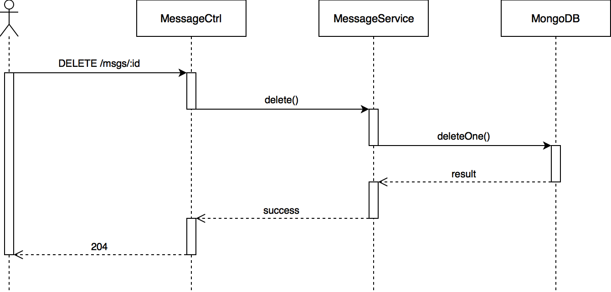

# Palindrome

A web application that checks if submitted messages are palindromes. See the [live demo](http://34.200.215.7/).

# Contents

* [Architecture](#architecture)
* [REST API](#rest-api)
* [Sequence Diagrams](#sequence-diagrams)
* [Deployment](#deployment)

# Architecture

The architecture is based on [Spring Framework](https://projects.spring.io/spring-framework/) application architectures.
Controllers handle the actual request to the server, validate the request information, and delegate more specific logic
to services. For example, the `MessageCtrl` handles validating the request parameters and then immediately delegates
logic to the `MessageService`. Services handle the actual logic and deal with interacting with the data layer. For example,
the `MessageService` determines if a message is a palindrome and then saves the result to MongoDB.

# REST API

## Get All Messages

### Request

| Method | URL |
| :--- | :--- |
| `GET` | `/msgs/` |

### Response

#### `200` Success

```JavaScript
{
  "items" : [
    {
      "id" : String,
      "value" : String,
      "palindrome" : Boolean
    }
  ]
}
```

## Get a Message

### Request

| Method | URL |
| :--- | :--- |
| `GET` | `/msgs/:id` |

| Parameter | Type | Description |
| :--- | :--- | :--- |
| `id` | `String` | The ID of the message |

### Response

#### `200` Success

```JavaScript
{
  "id" : String,
  "value" : String,
  "palindrome" : Boolean
}
```

#### `404` Not found

```JavaScript
{
  "error" : "Message not found"
}
```
## Create a Message

### Request

| Method | URL |
| :--- | :--- |
| `POST` | `/msgs/` |

#### Body

```JavaScript
{
  "value" : String
}
```

### Response

#### `200` Success

```JavaScript
{
  "id" : String,
  "value" : String,
  "palindrome" : Boolean
}
```

#### `400` Illegal Value

```JavaScript
{
  "error" : "Illegal value"
}
```

#### `409` Duplicate message

```JavaScript
{
  "error" : "Duplicate message"
}
```

## Update a Message

### Request

| Method | URL |
| :--- | :--- |
| `POST` | `/msgs/:id` |

| Parameter | Type | Description |
| :--- | :--- | :--- |
| `id` | `String` | The ID of the message |

#### Body

```JavaScript
{
  "value" : String
}
```
### Response

#### `200` Success

```JavaScript
{
  "id" : String,
  "value" : String,
  "palindrome" : Boolean
}
```

#### `400` Illegal Value

```JavaScript
{
  "error" : "Illegal value"
}
```

#### `404` Not found

```JavaScript
{
  "error" : "Message not found"
}
```

#### `409` Duplicate message

```JavaScript
{
  "error" : "Duplicate message"
}
```

## Delete a Message

### Request

| Method | URL |
| :--- | :--- |
| `DELETE` | `/msgs/:id` |

| Parameter | Type | Description |
| :--- | :--- | :--- |
| `id` | `String` | The ID of the message |

### Response

#### `204` Success

_No body_

#### `404` Not found

```JavaScript
{
  "error" : "Message not found"
}
```

# Sequence Diagrams

## Get All Messages



## Get a Message



## Create a Message



## Update a Message



## Delete a Message



# Deployment

## Build Browser

```bash
# Development build mode
$ npm run build-dev
# Production build mode
$ npm run build
```

## Run Server

```bash
# Development mode
$ npm run start-dev
# Production mode
$ npm run start
```

## AWS

[AWS CodeDeploy](https://aws.amazon.com/documentation/codedeploy/) is used to automate the deployment process. Currently
a user has to login to the AWS console and manually start the new deployment by giving it a new commit ID, but Github can be
setup to auto-deploy when a change occurs.
